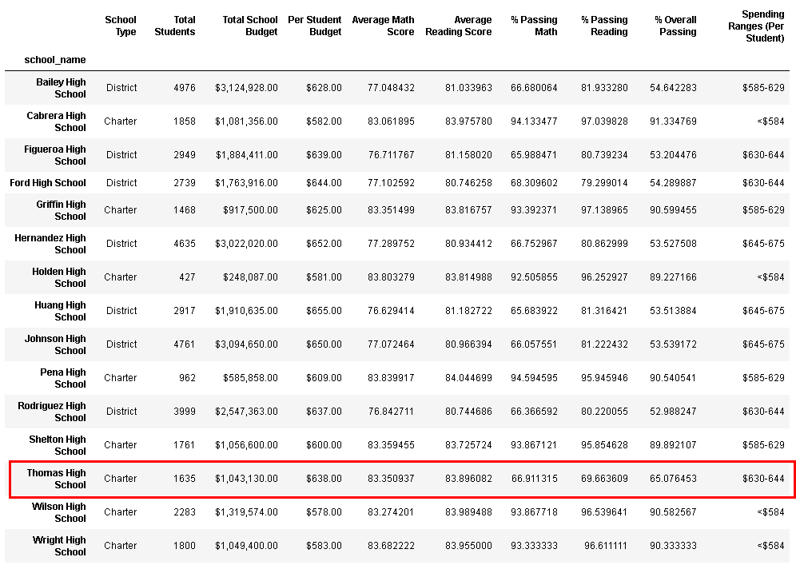
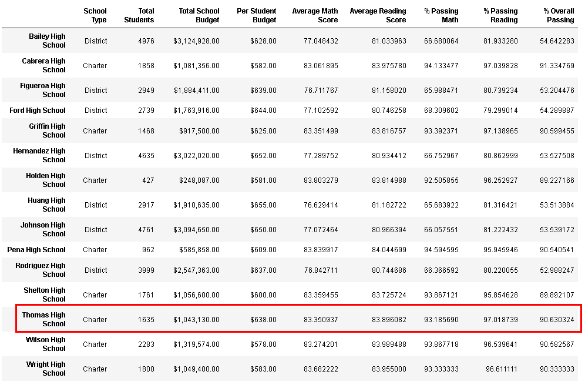

# School District Analysis
## Overview

The school board needs the standardized tests scores and school funding data for all of their schools analyzed to help determine future budget allocation and priorites.  There was suspected academic dishonesty so a very small portion of the data set (9th grade of Thomas High School) had to be excluded from the results. 

The Board asked for analysis on the following:
- Per School Summary part of the analysis.  
- Top 5 and Bottom 5 Schools based on Overall % Passing
- Scores By Grade
- Scores By School Spending
- Scores By School Size
- Scores by School Type

The data sets being used for analysis can be found using these links: [SchoolData](Resources/schools_complete.csv) and [StudentData](Resources/students_complete.csv)

## Results
Below summarizes the results and the effects that the excluded data had on it. 
### District and School Summaries
The overall school district summary was minimally affected by the thrown out data since it was such a small subset of data.  The per school summary only had the Thomas High School line of data affected.  By throwing out the scores, Thomas High Schools testing results were improved for both reading and math.  

School Results with all the data:

School Results without Thomas High School 9th Grade Results:

## Summary
Throwing out the 9th grade results for Thomas High School helped to improve the scores.  Since Thomas High School was a charter school, fell into the medium size school bracket, and the $630-644 per student spending bracket, all of those sections were impacted by the update.  Additionally, grade summary analysis for 9th grade was also affected.   